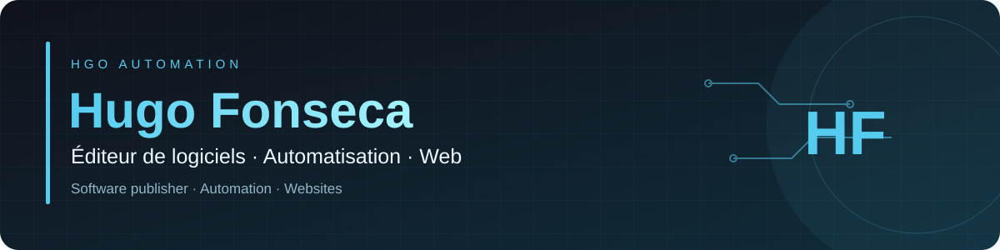

<h3 align="center">Éditeur de logiciels · Automatisation · Web</h3>

<strong>Software publisher · Automation · Websites</strong>

Des outils connectés pour une activité plus simple. <em>Connected tools for a simpler working day.</em>

<h3 align="center">Ma boîte à outils · My toolkit</h3>

---

## Français

### Bonjour, moi c’est Hugo

Je suis **éditeur de logiciels et freelance**. Je conçois des logiciels, crée des sites web et je connecte vos outils avec **n8n** et les **API**, pour simplifier les tâches répétitives de votre activité.

J’utilise aussi **Claude** et **ChatGPT** comme assistants dans mon travail. Mon approche : partir d’un besoin concret et construire une solution utile, compréhensible et adaptée à votre quotidien.

### ✦ Des solutions pour votre quotidien

| Votre besoin | Mon accompagnement |
| :--- | :--- |
| Concevoir un logiciel | Création de logiciels et d’applications adaptés à vos besoins. |
| Présenter votre activité | Création de sites web et de landing pages. |
| Éviter les tâches répétitives | Mise en place de scénarios d’automatisation avec n8n. |
| Faire communiquer vos logiciels | Intégrations API selon les possibilités de vos outils. |
| Utiliser l’IA dans votre quotidien | Accompagnement à l’utilisation de Claude et ChatGPT pour des tâches définies. |

### ◈ Une méthode claire

**Comprendre → Construire → Vérifier → Expliquer**

Nous clarifions votre besoin, les outils existants et les résultats attendus. Le périmètre est défini avant de commencer, puis la solution est ajustée avec vous.

---

<strong>🇬🇧 Read the English version</strong>

## English

### Hi, I’m Hugo

I’m a **software publisher and freelancer**. I create software, build websites and connect your tools using **n8n** and **APIs**, helping simplify repetitive tasks in your business.

I also use **Claude** and **ChatGPT** as assistants in my work. My approach is to start with a practical need and build a useful, understandable solution that fits your day-to-day work.

### How I can help

| Your need | My services |
| :--- | :--- |
| Create software | Software and applications tailored to your needs. |
| Present your business | Websites and landing pages. |
| Reduce repetitive work | Automation workflows built with n8n. |
| Connect your software | API integrations based on what your tools support. |
| Use AI in your daily work | Guidance on using Claude and ChatGPT for specific tasks. |

### How I work

**Understand → Build → Check → Explain**

We clarify your needs, existing tools and expected outcomes. We define the scope before starting, then refine the solution together.

---

---

<strong>Moins de tâches répétitives. Plus de temps pour l’essentiel.</strong> <em>Less busywork. More time for what matters.</em>

